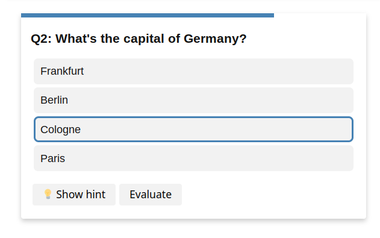

# quizdown [](https://badge.fury.io/gh/bonartm%2Fquizdown-js) [](https://github.com/bonartm/quizdown-js/actions/workflows/build.yml)


> Markdownish syntax to instantly create simple interactive quiz apps for your static website.

### 🚀 Try the [**quizdown live editor**](https://bonartm.github.io/quizdown-live-editor/)

- supports markdown text formatting, images and syntax highlighting.
- different quiz-types: single-choice, multiple-choice, sequence.
- support for hints and explanations.
- options for color theme, question shuffling, localization.
- can be easily included in any website, static site generator or other *svelte* projects.

## Usage

quizdown is easy to setup and best used in combination with existing static site generators like *Jekyll*, *Hugo* or *Sphinx*. Check out the extensions
[hugo-quiz](https://github.com/bonartm/hugo-quiz) and [sphinxcontrib-quizdown](https://github.com/bonartm/sphinxcontrib-quizdown).

### 📚 [Documentation](./docs/getting_started.md)


## Stand-alone Example

Add the library to your website and initialize with default options:

```html
<head>
	...
    <script 
	src="https://cdn.jsdelivr.net/gh/bonartm/quizdown-js@latest/public/build/quizdown.js">
	</script>
	<script>quizdown.init();</script>
	...
</head>
```

Write questions within a `quizdown` class:

```html
...
<div class="quizdown">
	---
	primary_color: steelblue
	shuffle_questions: false
	shuffle_answers: true
	---

	### Select your superpowers!

	- [ ] Enhanced Strength
	- [ ] Levitation
	- [x] Shapeshifting

	### What's the capital of Germany?

	> Hint: The _largest_ city in Germany...

	1. [x] Berlin
	1. [ ] Frankfurt
	1. [ ] Paris
	1. [ ] Cologne
</div>
...
```



## Contributing

Pull requests and feature requests are welcome. For major changes, please open an issue first to discuss what you would like to change.

Install the packages with 

```bash
npm install
```

Build the library with

```bash
npm run build
```

You can also preview a live version with

```bash
npm run dev
```

## Credits

Inspired by the [mermaid library](https://mermaid-js.github.io/mermaid/#/) and the python package [quizdown](https://github.com/jjfiv/quizdown).